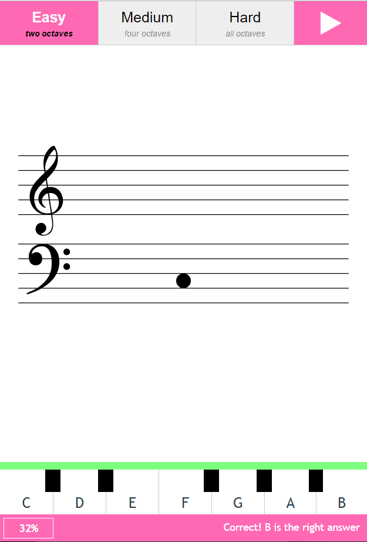

# Notable
Very simple site reading trainer for base and treble clef.  

Helps remember the names of the notes relative to their positions on the stave.  

Records progress in local storage so you can see you percentage improving over time. 

### Screenshots



### Development
Uses ```create-elm-app``` 

### To run
```
npm install
elm-app start
```
